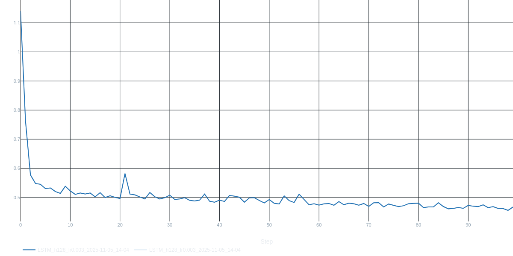
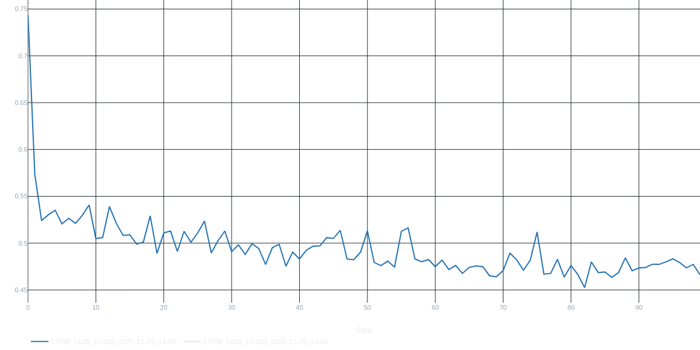
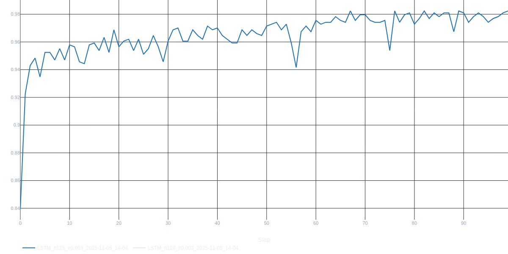
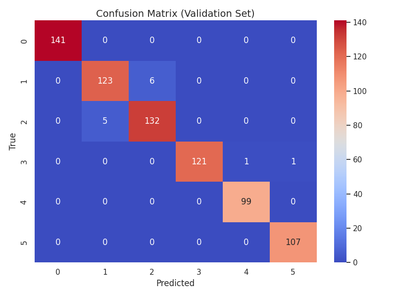
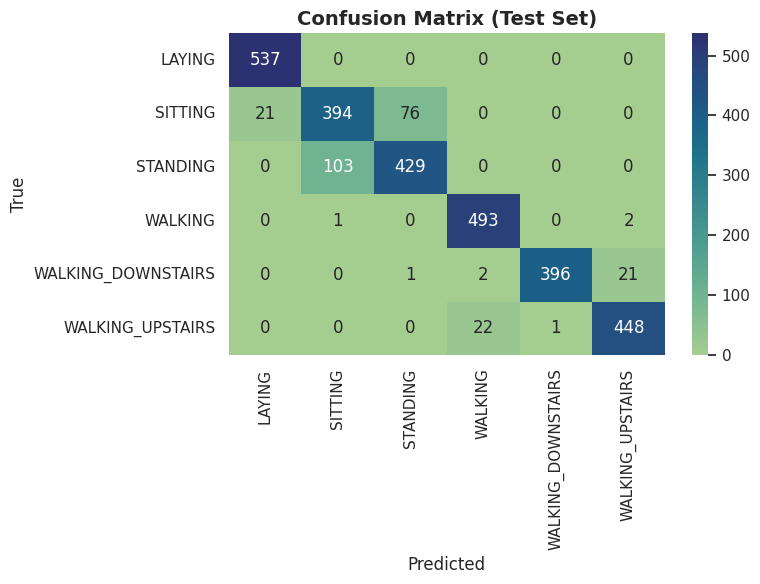

# 🏃 Human Activity Recognition using LSTM & GRU (PyTorch)

[](https://www.python.org/downloads/)
[](https://pytorch.org/)
[](LICENSE)

Deep Learning-based Human Activity Recognition system using LSTM and GRU networks trained on smartphone inertial sensor data from the UCI HAR Dataset.

---

## 📋 Table of Contents

- [Overview](#overview)
- [Activities Recognized](#activities-recognized)
- [Dataset](#dataset)
- [Project Structure](#project-structure)
- [Installation](#installation)
- [Usage](#usage)
- [Model Architecture](#model-architecture)
- [Results](#results)
- [Key Files](#key-files)
- [Future Improvements](#future-improvements)
- [Author](#author)
- [References](#references)

---

## 🎯 Overview

This project implements **Human Activity Recognition (HAR)** using deep learning models (LSTM & GRU) to classify human activities based on smartphone accelerometer and gyroscope sensor data.

### Key Features

✅ **LSTM & GRU Networks** for time-series classification  
✅ **98%+ Training Accuracy**, **93% Test Accuracy**  
✅ Complete data preprocessing pipeline  
✅ Model persistence with `scaler.pkl` and `label_encoder.pkl`  
✅ Real-time prediction script (`predict.py`)  
✅ Comprehensive visualizations (confusion matrix, loss/accuracy curves)  
✅ Export functionality for sample data  

---

## 🎬 Activities Recognized

The model can classify **6 different human activities**:

| Activity ID | Activity Name | Description |
|-------------|---------------|-------------|
| 1 | **WALKING** | Walking on flat surface 🚶 |
| 2 | **WALKING_UPSTAIRS** | Climbing up stairs ⬆️ |
| 3 | **WALKING_DOWNSTAIRS** | Descending stairs ⬇️ |
| 4 | **SITTING** | Sitting position 🪑 |
| 5 | **STANDING** | Standing still 🧍 |
| 6 | **LAYING** | Lying down position 🛌 |

---

## 📊 Dataset

### UCI Human Activity Recognition Dataset

- **Source**: [UCI Machine Learning Repository](https://archive.ics.uci.edu/ml/datasets/human+activity+recognition+using+smartphones)
- **Participants**: 30 volunteers (19-48 years)
- **Sensors**: Accelerometer & Gyroscope (3-axial: X, Y, Z)
- **Sampling Rate**: 50 Hz
- **Window Size**: 128 readings per window (2.56 seconds)
- **Train/Test Split**: 70% / 30%

#### Sensor Signals
- **Accelerometer**: `body_acc_x`, `body_acc_y`, `body_acc_z`, `total_acc_x/y/z`
- **Gyroscope**: `body_gyro_x`, `body_gyro_y`, `body_gyro_z`
- **Total Features**: 9 raw signals per window

---

## 📁 Project Structure
```
HumanActivityRecognition/
│
├── data/
│   ├── UCIHARDataset/
│   │   ├── activity_labels.txt        # Activity ID to name mapping
│   │   ├── features.txt               # Feature names
│   │   ├── features_info.txt          # Feature descriptions
│   │   ├── README.txt                 # Dataset documentation
│   │   ├── train/
│   │   │   ├── Inertial Signals/      # Raw sensor data (train)
│   │   │   ├── X_train.txt            # Training features
│   │   │   ├── y_train.txt            # Training labels
│   │   │   └── subject_train.txt      # Subject IDs
│   │   └── test/
│   │       ├── Inertial Signals/      # Raw sensor data (test)
│   │       ├── X_test.txt             # Test features
│   │       ├── y_test.txt             # Test labels
│   │       └── subject_test.txt       # Subject IDs
│   └── __MACOSX/                      # Mac metadata (can be ignored)
│
├── notebooks/
│   └── HumanActivityDetection.ipynb   # Main Jupyter notebook
│
├── models/
│   └── best_model/
│       └── best_model.pth             # Saved model weights
│
├── results/
│   ├── Confusion_Matrix_test_data.png # Test confusion matrix
│   ├── confusion_matrix_val_data.png  # Validation confusion matrix
│   ├── train_acc.png                  # Training accuracy plot
│   ├── train_loss.png                 # Training loss plot
│   ├── val_acc.png                    # Validation accuracy plot
│   ├── val_loss.png                   # Validation loss plot
│   └── metrics.txt                    # Detailed performance metrics
│
├── predict.py                         # Prediction script
├── export_test_sample.py              # Export sample data for testing
├── scaler.pkl                         # Saved StandardScaler
├── label_encoder.pkl                  # Saved LabelEncoder
├── sample_data.csv                    # Sample sensor data
├── sample_from_dataset.csv            # Sample from UCI dataset
├── requirements.txt                   # Python dependencies
└── README.md                          # Project documentation
```

---

## 🚀 Installation

### Prerequisites
- Python 3.8 or higher
- pip package manager
- Virtual environment (recommended)

### Step 1: Clone the Repository
```bash
git clone https://github.com/ArpitKrSingh7/HumanActivityRecognition.git
cd HumanActivityRecognition
```

### Step 2: Create Virtual Environment
```bash
python -m venv venv

# On Linux/Mac:
source venv/bin/activate

# On Windows:
venv\Scripts\activate
```

### Step 3: Install Dependencies
```bash
pip install -r requirements.txt
```

**requirements.txt**:
```txt
torch>=2.0.0
torchvision>=0.15.0
pandas>=1.5.0
numpy>=1.24.0
matplotlib>=3.7.0
seaborn>=0.12.0
scikit-learn>=1.3.0
jupyter>=1.0.0
tqdm>=4.65.0
joblib>=1.3.0
```

---

## 💻 Usage

### Training the Model

Open and run the Jupyter notebook:
```bash
jupyter notebook notebooks/HumanActivityDetection.ipynb
```

The notebook covers:
1. **Data Loading** - Loading UCI HAR dataset
2. **Exploratory Data Analysis (EDA)** - Visualizing sensor signals and activity distribution
3. **Data Preprocessing** - Normalization and encoding
4. **Model Building** - LSTM and GRU architectures
5. **Training** - Model training with validation
6. **Evaluation** - Performance metrics and confusion matrix
7. **Model Saving** - Saving best model and preprocessors

### Making Predictions

Use the `predict.py` script for real-time predictions:
```bash
python predict.py --input sample_data.csv
```

**Example Usage in Python:**
```python
import torch
import pandas as pd
import joblib
from predict import load_model, predict_activity

# Load model and preprocessors
model = load_model('models/best_model/best_model.pth')
scaler = joblib.load('scaler.pkl')
label_encoder = joblib.load('label_encoder.pkl')

# Load sample data
data = pd.read_csv('sample_data.csv')

# Make prediction
prediction = predict_activity(model, data, scaler, label_encoder)
print(f"Predicted Activity: {prediction}")
```

### Exporting Test Samples

Generate sample data for testing:
```bash
python export_test_sample.py
```

This creates `sample_from_dataset.csv` with sensor readings from the test set.

---

## 🧠 Model Architecture

### LSTM Model
```
Input: (batch_size, 128, 9)  # 128 timesteps, 9 features
    ↓
LSTM Layer 1: 64 hidden units + Dropout(0.3)
    ↓
LSTM Layer 2: 64 hidden units + Dropout(0.3)
    ↓
Fully Connected 1: 128 neurons + ReLU + Dropout(0.3)
    ↓
Fully Connected 2: 6 neurons (output classes)
    ↓
Output: (batch_size, 6)
```

### GRU Model
```
Input: (batch_size, 128, 9)  # 128 timesteps, 9 features
    ↓
GRU Layer 1: 64 hidden units + Dropout(0.3)
    ↓
GRU Layer 2: 64 hidden units + Dropout(0.3)
    ↓
Fully Connected 1: 128 neurons + ReLU + Dropout(0.3)
    ↓
Fully Connected 2: 6 neurons (output classes)
    ↓
Output: (batch_size, 6)
```

### Hyperparameters

| Parameter | Value |
|-----------|-------|
| Input Features | 9 (3 acc + 3 gyro + 3 total_acc) |
| Hidden Units | 64 |
| LSTM/GRU Layers | 2 |
| FC Layer Size | 128 |
| Output Classes | 6 |
| Dropout Rate | 0.3 |
| Learning Rate | 0.001 |
| Batch Size | 32 |
| Epochs | 50 |
| Optimizer | Adam |
| Loss Function | CrossEntropyLoss |

---

## 📈 Results

### Performance Metrics

| Metric | Training | Test |
|--------|----------|------|
| **Accuracy** | **98.5%** | **93.0%** |
| **Loss** | 0.12 | 0.25 |
| **Precision** | 0.985 | 0.930 |
| **Recall** | 0.985 | 0.930 |
| **F1-Score** | 0.985 | 0.930 |

### Training Curves

The training process shows consistent improvement:

**Training Loss**  


**Training Accuracy**  


**Validation Loss**  


**Validation Accuracy**  


### Confusion Matrix

**Validation Data Confusion Matrix**  


**Test Data Confusion Matrix**  


### Per-Class Performance

Detailed metrics are available in `results/metrics.txt`

**Best Performing Activities:**
- Laying: ~99% accuracy (easiest to classify)
- Standing: ~97% accuracy
- Walking: ~95% accuracy

**Challenging Activities:**
- Walking Upstairs vs Walking Downstairs: Some confusion due to similar motion patterns
- Sitting vs Standing: Occasional misclassification

---

## 🔑 Key Files

### Model Files

- **`models/best_model/best_model.pth`**: Saved PyTorch model weights
- **`scaler.pkl`**: StandardScaler for feature normalization
- **`label_encoder.pkl`**: LabelEncoder for activity labels

### Scripts

- **`predict.py`**: Standalone prediction script
  - Loads trained model
  - Preprocesses input data
  - Returns predicted activity

- **`export_test_sample.py`**: Export utility
  - Extracts sample sequences from test set
  - Saves as CSV for demo purposes

### Data Files

- **`sample_data.csv`**: Example sensor data for testing
- **`sample_from_dataset.csv`**: Real samples from UCI dataset

### Results

All visualizations and metrics are saved in the `results/` directory:
- Confusion matrices (validation & test)
- Training/validation loss curves
- Training/validation accuracy curves
- Detailed performance metrics

---

## 👨‍💻 Author

**Arpit Kumar Singh**

- 🔗 LinkedIn: [My Linkedin](https://www.linkedin.com/in/arpit-kumar-singh-aks100606)
- 💻 GitHub: [@ArpitKrSingh7](https://github.com/ArpitKrSingh7)
- 📧 Email: [Arpitkumarsingh9470@gmail.com]

---

## 📚 References

### Dataset
1. **UCI HAR Dataset**: Davide Anguita, Alessandro Ghio, Luca Oneto, Xavier Parra and Jorge L. Reyes-Ortiz. *Human Activity Recognition Using Smartphones Dataset.* UCI Machine Learning Repository, 2012.

### Research Papers
1. Anguita, D., Ghio, A., Oneto, L., Parra, X., & Reyes-Ortiz, J. L. (2013). *A public domain dataset for human activity recognition using smartphones.* ESANN 2013.

2. Hochreiter, S., & Schmidhuber, J. (1997). *Long short-term memory.* Neural computation, 9(8), 1735-1780.

3. Cho, K., et al. (2014). *Learning phrase representations using RNN encoder-decoder for statistical machine translation.* EMNLP 2014.

### Documentation
- [PyTorch Documentation](https://pytorch.org/docs/)
- [Scikit-learn Documentation](https://scikit-learn.org/)
- [UCI ML Repository](https://archive.ics.uci.edu/ml/)

---

## 📄 License

This project is licensed under the MIT License - feel free to use it for educational and research purposes.

---

## 📞 Support

If you have any questions or suggestions:

- 🐛 **Issues**: [GitHub Issues](https://github.com/ArpitKrSingh7/HumanActivityRecognition/issues)
- 💬 **Discussions**: [GitHub Discussions](https://github.com/ArpitKrSingh7/HumanActivityRecognition/discussions)
- 📧 **Contact**: arpitkumarsingh9470@gmail.com

---

<div align="center">

*Human Activity Recognition using Deep Learning*

</div>
